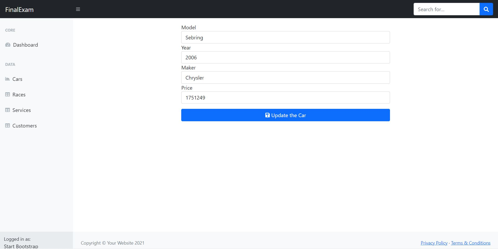
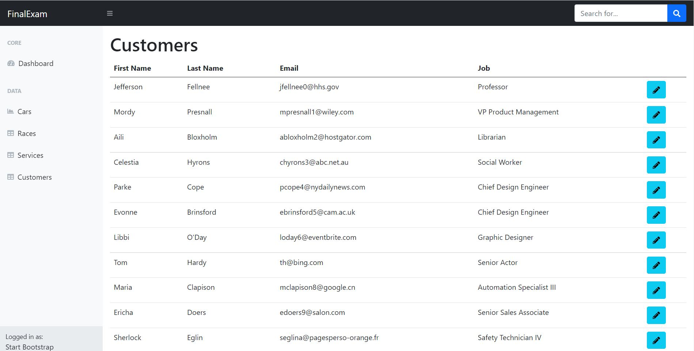

# Struktúraváltás FullStackAPI Záróvizsga 

## Bevezető
Kedves Barátom!  
Örülök, hogy köszönthetlek ezen a vizsgán, és sok sikert kívánok neked.  

## Előkészítés

### Backend
- Forkold magadnak ezt a repository -t a saját Github fiókodba.
- Lépj be a terminal -on a `/backend` mappába és futtasd az `npm i` parancsot.
- Indítsd el a Dokcer Desktop alkalmazást.
- Lépj be a `/backend` mappába és állítsd be gyökér mappának: `code . -r`.
- Indítsd el az api -t a következő paranccsal: `npm run dev`.

### Frontend
- Lépj be a terminal -on a `/frontend` mappába és futtasd az `npm i` parancsot.
- Nyiss egy új VSCode -ot az adott mappában, itt fogod szerkeszteni a frontend -et: 
`code .`
- Indítsd el a frontendet a következő paranccsal: `npm start`

## Feladatok

### 1. Feladat
- BACKEND FELADAT!
- API útvonal: `http://localhost:3000/services`
- Pótold Mongoose modellt az `backend/src/models/service.model.js` fájlban.
- A modell pontosan kövesse a kapcsolódó adatmodelljének a mintáját.
- A `backend/src/server.js` fájlban módosítsd a `/services` url -re érkező 
kérések esetén a routert, hogy a service router szolgálja ki a kéréseket.

### 2. Feladat
- BACKEND FELADAT!
- API útvonal: `http://localhost:3000/races`
- Pótold a backend -en a `backend/src/controllers/race` mappában hiányzó 
service -t, routert, és controller -t.
- A validálásnak és a működésnek a többi controllerét kell követnie.
- A modellt készen kapod: `backend/src/models/race.model.js`.
- A `backend/src/server.js` fájlban módosítsd a `/races` url -re érkező 
kérések esetén a routert, hogy a race router szolgálja ki a kéréseket.

### 3. Feladat
- FRONTEND FELADAT!
- API útvonal: `http://localhost:3000/cars`
- A Frontend VSCode -jában kell dolgoznod!
- Pótold a hiányzó részeket a `frontend/src/app/page/car-edit` komponensben, 
hogy lehetővé váljon a járművek szerkesztése. A .ts és a .html fájlban is 
dolgoznod kell.
- A szerkesztő oldalra az autók listájából jutsz el, a sorok végén látható 
kék gombra kattintva.
- A következő tulajdonságokat kell szerkeszthetővé tenned: 
`model`, `year`, `maker`, `price`.
- Légy óvatos! A carService -nek küldött objektumban mindenképp legyen `_id`, 
mert a BaseService a kapott objektum alapján küldi el a kérést a szervernek.
- Minta:  

### 4. Feladat
- FRONTEND FELADAT!
- API útvonal: `http://localhost:3000/customers`
- Listázd ki a Frontend -en a Customer -eket!
- Pótold a hiányzó részeket a `frontend/src/app/page/customer` komponensben, 
hogy lehetővé váljon a vásárlók listázása. A .ts és a .html fájlban is 
dolgoznod kell.
- Táblázatos formában jelenítsd meg a vásárlókat, minden sor végén legyen egy 
gomb, amire kattitva a szerkesztő oldalra jutunk (ez az oldal készen van).
- A táblázat oszlopaiban a következő adatok jelenjenek meg: 
`firstName`, `lastName`, `email`, `job`.
- Minta:  

### 5. Feladat
- BACKEND FELADAT!
- A `bakcend/src/docs/swager.yaml` fájlban dolgozz.
- A Backend -en pótold a `/race` végpontra küldhető kérések listáját.
- Készítd el a kapcsolódó Mongoose modell alapján a Race schema -t is és arra 
hivatkozz az egyes url -eknél.
- Minden metódus és url variáció szerepeljen, tehát az egy entitás lekérése, az 
összes lekérése, a létrehozás, frissítés és a törlés is. Tehát 5 végpontot 
kell definiálnod.
- Ahol request body -t kér, ott pontosan legyenek feltüntetve a kötelező mezők.
- Ahol szükséges paraméter (pld: _id), ott pedig azt is meg lehessen adni.

## Hasznos tudnivalók
- A feladatok nehezedő sorrendben vannak. Sorban oldd meg őket ha lehet.
- Minden feladat önállóan is megoldható, ha az egyik nem sikerül, az nem 
befolyásolja a másik sikerességét.
- De! Ha nem sikerült egy feladat és ki akarod hagyni, állítsd vissza abba az 
állapotba a feladathoz kapcsolódó kódot ahogy az előtt a feladat előtt volt ;-)
- Az alkalmazás figyeli a fájlokat és amikor szerkeszted a backend -et újra 
is indítja azt. Ez a funkció az `npm run dev` indítóparancs esetén működik. 
Ha hiba lépne fel, akkor használhatod az `npm run docker-compose:up` 
parancsot is, de ebben az esetben a backend -et minden változtatás után 
_MANUÁLISAN ÚJRA KELL INDÍTANOD_!
